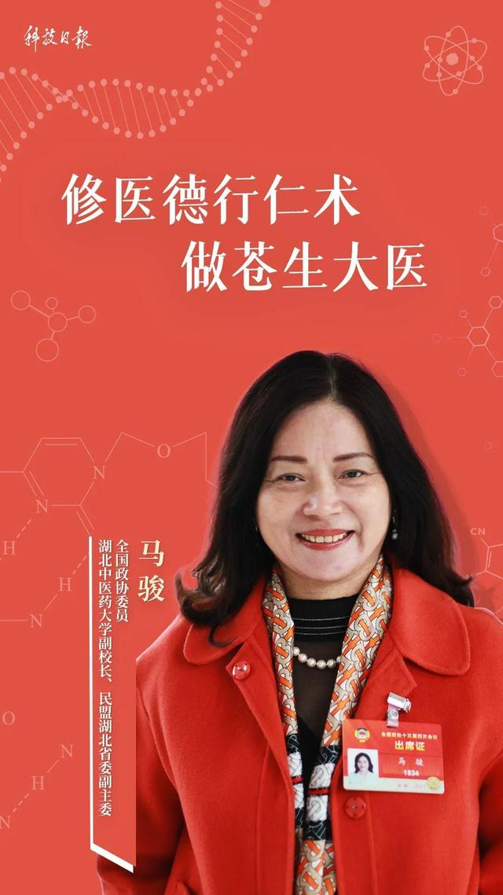
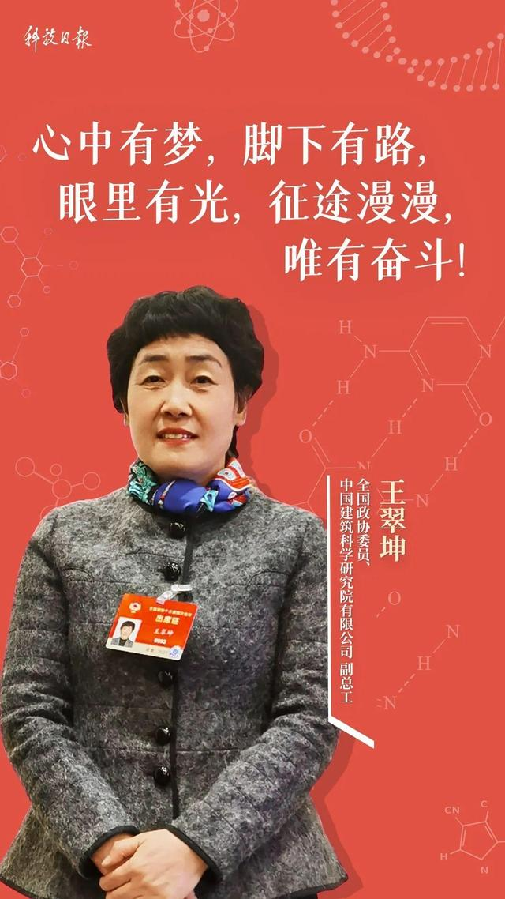
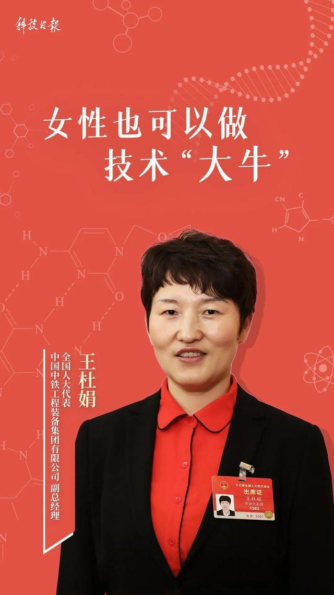
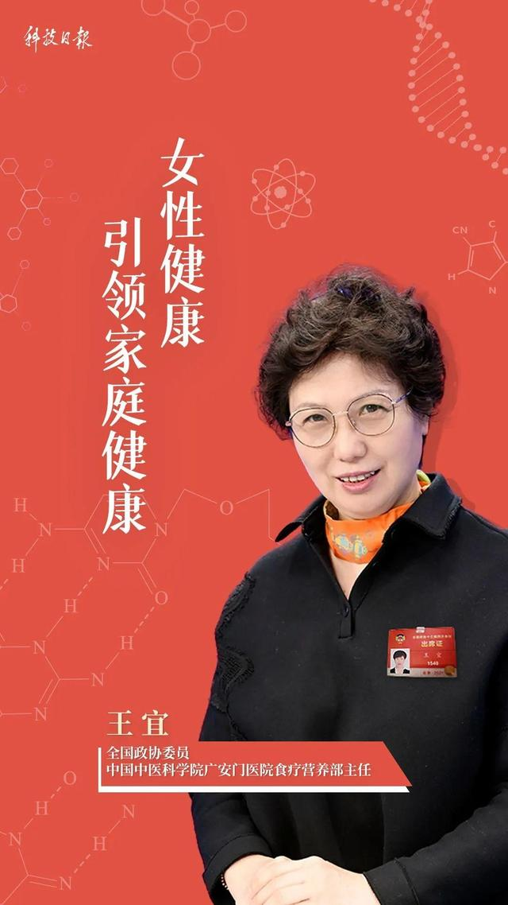
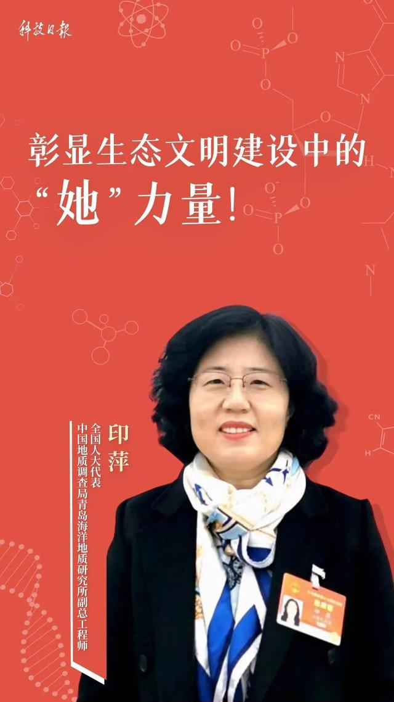
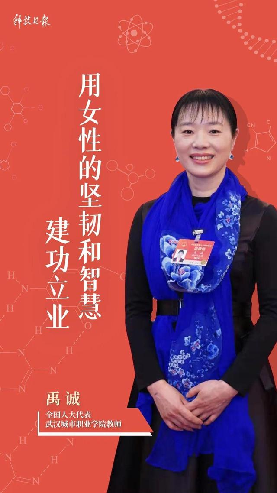
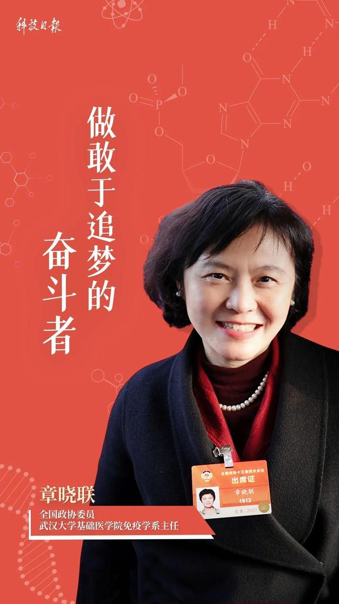

# 科技遇见她

## 分享你与科技的#HERstory

### 一小时编程挑战直播课

#### 等你来挑战

_联合国开发计划署_

_联合国妇女署_

_Coding Girls Club_

> 在联合国#平等的一代#倡导活动的框架之下，联合国开发计划署（UNDP）与联合国妇女署（UN Women）共同发起#HERstory# #科技遇见她#倡议活动，聚焦科技领域、开启故事征集，将许许多多个体的故事汇流成川，为广大有志进入科技领域的女性赋予信心。 

##### 文章摘自https://mp.weixin.qq.com/s/VDz_vVvVacRfqlRhqiYY_Q?

#### 【致敬！女科技工作者】

##### “三八”国际劳动妇女节，全称“联合国妇女权益和国际和平日”。

我们在这一天，庆祝女性在经济、政治、社会等各个领域做出的重要贡献和取得的巨大成就。

在这一天，我们将目光投向代表委员中的女性科技工作者。

在医药卫生领域、在工程建设领域、在科技研发领域，在那些传统被认为“男性主导”的领域，其实都活跃着她们的身影。

她们有着多重身份。在家里，在单位，都是不可或缺的那一个。

但挣脱所有传统观念的束缚，女性，就是她们自己。

她们愿意探索，敢于攻坚。她们热爱着自己的职业，也畅想着改变社会。

她们在自己的领域踏实前行，也将人类知识的边界向外拓展。

我们为她们的成就喝彩，也和她们的困境共情。

我们对女性的关心，不止于这一天。

我们期待聆听更多来自她们的声音。

